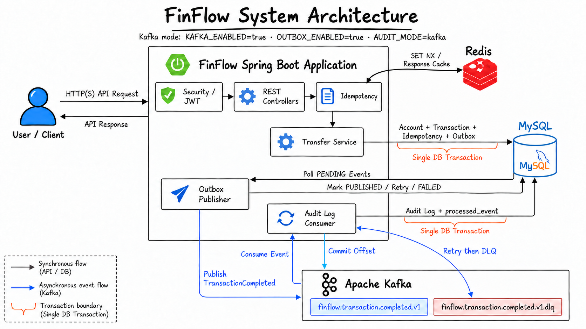

# FinFlow

> 동시 요청과 장애 상황에서도 거래 정합성을 지키는 금융 거래 API

FinFlow는 회원, 계좌, 입금·출금·이체 기능을 제공하는 Spring Boot 기반 백엔드 프로젝트입니다. 단순한 금융 CRUD 구현을 넘어, 실제 거래 시스템에서 문제가 되는 **동시성 충돌**, **중복 요청**, **DB와 메시지 브로커 간 Dual Write**를 다룹니다.

- 비관적 락과 일관된 락 순서로 계좌 잔액 충돌을 제어합니다.
- `Idempotency-Key`, MySQL 유니크 제약, Redis 캐시를 조합해 중복 이체를 방지합니다.
- Transactional Outbox로 거래 저장과 Kafka 이벤트 발행 사이의 유실 가능성을 줄입니다.
- 멱등 Consumer와 DLQ로 at-least-once 전달 환경의 중복·실패를 처리합니다.
- 단위 테스트, 실제 인프라 통합 테스트, k6 부하 테스트로 주요 보장을 검증합니다.

## 목차

- [핵심 설계](#핵심-설계)
- [아키텍처](#아키텍처)
- [기술 스택](#기술-스택)
- [API](#api)
- [시작하기](#시작하기)
- [환경 설정](#환경-설정)
- [테스트](#테스트)
- [관측과 운영](#관측과-운영)
- [프로젝트 구조](#프로젝트-구조)
- [문서](#문서)

## 핵심 설계

| 문제 | 해결 방법 | 최종 보장 주체 |
| --- | --- | --- |
| 동시에 같은 계좌 잔액 변경 | `PESSIMISTIC_WRITE` 락, 계좌번호 오름차순 락 획득 | MySQL 트랜잭션 |
| 네트워크 재시도로 동일 이체 중복 실행 | 요청 해시와 `Idempotency-Key` 검증 | `idempotency_record` 유니크 제약 |
| 진행 중인 동일 요청의 동시 진입 | Redis `SET NX`와 processing TTL | Redis 선점 + DB 폴백 |
| 완료된 요청의 반복 처리 비용 | 완료 응답을 Redis에 24시간 캐시 | MySQL 멱등성 레코드 |
| 거래 커밋 후 이벤트 발행 실패 | 거래와 Outbox 이벤트를 한 트랜잭션에 저장 | Transactional Outbox |
| Kafka 이벤트 중복 전달 | `eventId` 기반 처리 이력 저장 | `processed_event` 유니크 제약 |
| Consumer 처리 실패 | 재시도 후 DLQ 전송, 정상 처리 후 offset 커밋 | Kafka + Consumer 트랜잭션 |

### 이체 정합성

이체 시 출금·입금 계좌를 하나의 DB 트랜잭션에서 변경하고 거래내역과 멱등성 레코드도 함께 저장합니다. 두 계좌는 계좌번호 오름차순으로 잠가 반대 방향의 동시 이체에서도 데드락 가능성을 낮췄습니다. 과정 중 하나라도 실패하면 잔액과 거래내역이 모두 롤백됩니다.

### 다층 멱등성

```text
Idempotency-Key + 요청 해시 검증
  → Redis 완료 응답 조회
  → SET NX로 처리 권한 선점
  → 계좌 락 및 이체 트랜잭션
  → DB 멱등성 레코드 저장
  → 커밋 후 Redis 응답 캐시
```

같은 키와 다른 요청 본문을 함께 보내면 충돌로 처리합니다. Redis가 비활성화되거나 장애가 발생해도 DB 경로로 폴백하며, Redis TTL 만료 후에도 DB 유니크 제약이 중복 거래를 최종 차단합니다.

### 신뢰할 수 있는 이벤트 처리

거래 데이터와 Outbox 이벤트를 같은 트랜잭션으로 커밋한 뒤 Polling Publisher가 Kafka에 발행합니다. Consumer는 감사 로그와 처리 이력을 하나의 트랜잭션으로 저장하므로, 재전달된 이벤트를 안전하게 무시할 수 있습니다. 재시도 한도를 초과한 이벤트는 DLQ로 분리합니다.

이 구조의 전달 보장은 **at-least-once 발행 + 멱등 소비**입니다. Kafka가 계좌 락이나 핵심 이체 처리량 자체를 확장해 주는 것은 아니며, 거래 이후의 감사·알림·통계 작업을 분리하는 역할을 합니다.

## 아키텍처



```text
Client
  └─ Spring Security / JWT
      └─ Controller → Service → Repository
          ├─ MySQL: 계좌, 거래, 멱등성, Outbox의 최종 저장소
          ├─ Redis: 진행 중 요청 선점 및 완료 응답 캐시
          └─ Outbox Publisher → Kafka → Consumer
                                      ├─ 감사 로그
                                      ├─ 처리 이력
                                      └─ 재시도 / DLQ
```

애플리케이션은 Controller–Service–Repository 레이어를 분리하고, 서비스 계층을 트랜잭션 경계로 사용합니다. 운영 스키마 변경은 Flyway 마이그레이션으로 관리합니다.

## 기술 스택

| 구분 | 기술 |
| --- | --- |
| Language | Java 21 |
| Framework | Spring Boot 3.5.7, Spring MVC, Spring AOP, Bean Validation |
| Security | Spring Security, JWT, BCrypt |
| Persistence | Spring Data JPA, JPQL, Flyway |
| Database | MySQL 8.4, H2 |
| Cache | Redis 7.4 |
| Messaging | Apache Kafka 3.9, Spring Kafka, Transactional Outbox |
| Observability | Spring Boot Actuator, Micrometer, Prometheus |
| Test | JUnit 5, Mockito, Testcontainers, Awaitility, k6 |
| Infrastructure | Docker Compose, Gradle |

## API

인증이 필요한 경로에는 `Authorization: Bearer <token>` 헤더를 전달합니다. 이체 API는 추가로 `Idempotency-Key`가 필요합니다.

| Method | Endpoint | 인증 | 설명 |
| --- | --- | :---: | --- |
| `POST` | `/api/join` | - | 회원가입 |
| `POST` | `/api/login` | - | 로그인 및 JWT 발급 |
| `POST` | `/api/s/account` | O | 계좌 생성 |
| `GET` | `/api/s/account/loginUser` | O | 내 계좌 목록 조회 |
| `GET` | `/api/s/account/{number}` | O | 계좌 상세 조회 |
| `DELETE` | `/api/s/account/{number}` | O | 계좌 삭제 |
| `POST` | `/api/account/deposit` | - | 입금 |
| `POST` | `/api/s/account/withdraw` | O | 출금 |
| `POST` | `/api/s/account/transfer` | O | 멱등 이체 |
| `GET` | `/api/s/account/{number}/transaction` | O | 거래내역 필터·페이징 조회 |

로그인 성공 시 JWT는 응답의 `Authorization` 헤더에 담깁니다. 거래내역 조회는 `transaction_type`(`ALL`, `DEPOSIT`, `WITHDRAW`)과 0부터 시작하는 `page` 쿼리 파라미터를 지원합니다.

## 시작하기

### 사전 요구사항

- JDK 21
- Docker 및 Docker Compose

### 1. 빠른 실행 — H2

기본 `dev` 프로필은 H2 인메모리 데이터베이스를 사용합니다.

```bash
./gradlew bootRun
```

서버는 `http://localhost:8081`에서 실행됩니다.

### 2. 전체 인프라 실행 — MySQL, Redis, Kafka

```bash
docker compose up -d --wait mysql redis kafka

SPRING_PROFILES_ACTIVE=dev,mysql \
SPRING_JPA_SHOW_SQL=false \
KAFKA_ENABLED=true \
OUTBOX_ENABLED=true \
AUDIT_MODE=kafka \
./gradlew bootRun
```

인프라 상태를 확인하거나 종료하려면 다음 명령을 사용합니다.

```bash
docker compose ps
docker compose down
```

> `docker compose down -v`는 MySQL과 Redis 볼륨까지 삭제합니다. 로컬 데이터 초기화가 필요한 경우에만 사용하세요.

### 로컬 포트

| 구성 요소 | 포트 |
| --- | ---: |
| Spring Boot | `8081` |
| MySQL | `3307` |
| Redis | `6380` |
| Kafka | `9092` |

## 환경 설정

로컬 실행에는 기본값이 제공됩니다. 다른 인프라를 사용할 때만 값을 덮어쓰면 됩니다.

| 환경 변수 | 기본값 | 설명 |
| --- | --- | --- |
| `SPRING_PROFILES_ACTIVE` | `dev` | 활성 Spring 프로필 |
| `MYSQL_HOST` / `MYSQL_PORT` | `localhost` / `3307` | MySQL 접속 정보 |
| `MYSQL_DATABASE` | `finflow` | MySQL 데이터베이스 |
| `MYSQL_USERNAME` / `MYSQL_PASSWORD` | `finflow` / `finflow` | MySQL 인증 정보 |
| `REDIS_HOST` / `REDIS_PORT` | `localhost` / `6380` | Redis 접속 정보 |
| `FINFLOW_IDEMPOTENCY_REDIS_ENABLED` | `true` (`mysql` 프로필) | Redis 멱등성 계층 활성화 |
| `KAFKA_BOOTSTRAP_SERVERS` | `localhost:9092` | Kafka 브로커 |
| `KAFKA_ENABLED` | `false` | Kafka 발행·소비 활성화 |
| `OUTBOX_ENABLED` | `true` | Outbox Publisher 활성화 |
| `AUDIT_MODE` | `none` | 감사 처리 모드 (`none`, `sync`, `kafka`) |

운영 환경은 `prod` 프로필과 `rds.hostname`, `rds.port`, `rds.db.name`, `rds.username`, `rds.password` 속성을 사용하며, Flyway가 스키마를 검증·마이그레이션합니다. 전체 옵션은 [`application.yml`](src/main/resources/application.yml)과 [`application-prod.yml`](src/main/resources/application-prod.yml)을 참고하세요.

## 테스트

### 단위 및 기본 통합 테스트

외부 인프라가 필요하지 않은 테스트를 실행합니다.

```bash
./gradlew test
```

### 실제 인프라 통합 테스트

MySQL·Redis 기반 동시성/롤백/멱등성 테스트와, 설정 시 Kafka 통합 테스트를 실행합니다.

```bash
docker compose up -d --wait mysql redis kafka
RUN_KAFKA_INTEGRATION_TESTS=true ./gradlew integrationTest
```

| 범위 | 주요 검증 내용 |
| --- | --- |
| 서비스·컨트롤러 | 비즈니스 분기, 인증·인가, 입력 검증 |
| MySQL | 트랜잭션 롤백, 비관적 락, 유니크 제약 |
| Redis | `SET NX` 최초 선점, 캐시 적중, DB 폴백 |
| Kafka | Outbox 복구, 재전달, 중복 소비, DLQ |
| k6 | DB-only/Redis 비교, 동일 키 경합, 지속·증가·피크 부하 |

k6 실행법과 결과 해석은 [부하 테스트 가이드](docs/k6-load-test.md), Kafka 성능 비교는 [Kafka·Outbox 벤치마크](docs/kafka-benchmark.md)에 정리되어 있습니다.

## 관측과 운영

Actuator는 `health`, `info`, `metrics`, `prometheus` 엔드포인트를 노출합니다. 다음 항목을 중심으로 Outbox 및 Consumer 상태를 관찰할 수 있습니다.

- 미발행 Outbox 적체와 가장 오래된 이벤트의 대기 시간
- 발행 성공·실패 및 재시도 횟수
- Consumer 처리 성공·실패·중복·DLQ 건수
- 보존 기간이 지난 Outbox와 처리 이력 정리 상태

운영 마이그레이션, 알람 기준, 데이터 보존 정책은 [운영 준비 문서](docs/operations-readiness.md)를 참고하세요.

## 프로젝트 구조

```text
src/main/java/com/FinFlow
├── config/        # Security, JWT, Kafka 및 초기 데이터 설정
├── controller/    # 회원·계좌·거래 API
├── domain/        # JPA 엔티티와 도메인 타입
├── dto/           # 요청·응답 모델
├── event/         # Outbox Publisher, Kafka Consumer, 메트릭·정리 작업
├── repository/    # JPA Repository와 거래 조회 구현
└── service/       # 거래, 멱등성, 감사 로그 비즈니스 로직

src/main/resources
├── db/migration/  # Flyway 스키마
└── application-*.yml

loadtest/          # k6 시나리오와 벤치마크 스크립트
docs/              # 설계·검증·운영 문서
```

## 문서

- [ADR: Kafka Transactional Outbox 도입](docs/adr/ADR-001-kafka-transactional-outbox.md)
- [거래 처리와 DB 트랜잭션](docs/transaction.md)
- [계좌 잔액 동시성 제어](docs/concurrency-lock.md)
- [이체 요청 멱등성](docs/idempotency.md)
- [테이블 구조와 ERD](docs/table.md)
- [Docker Compose 실행 가이드](docs/docker-compose.md)
- [k6 이체 멱등성 부하 테스트](docs/k6-load-test.md)
- [Kafka·Outbox 비교 테스트](docs/kafka-benchmark.md)
- [Kafka 이벤트 처리 테스트](docs/kafka-tests.md)
- [Kafka Outbox 운영 준비](docs/operations-readiness.md)
