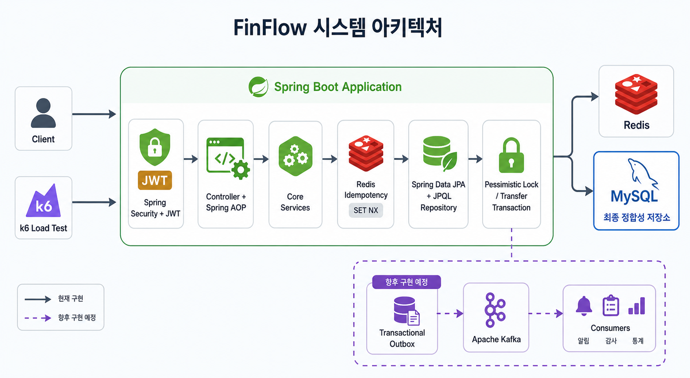
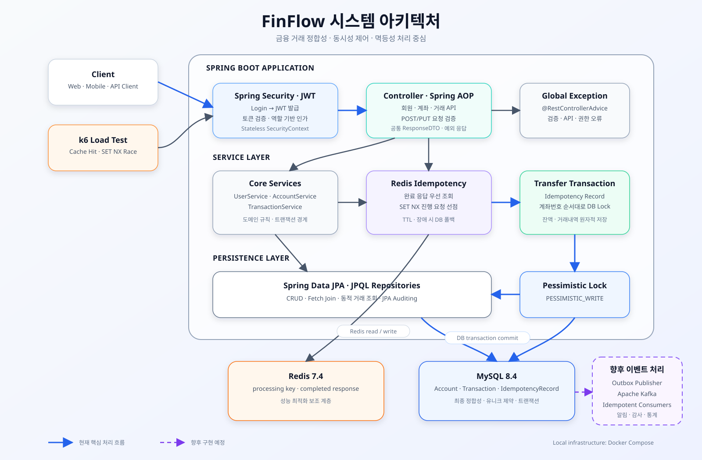

# FinFlow 💸

Spring Boot 기반 금융 거래 API입니다. 계좌 생성, 입금, 출금, 이체 기능을 제공하며, 단순 CRUD를 넘어 트랜잭션 원자성, 동시성 충돌, 중복 요청과 같은 금융 거래의 정합성 문제를 단계적으로 해결합니다.

## 목차

- [프로젝트 소개](#프로젝트-소개)
- [주요 기능](#주요-기능)
- [기술 스택](#기술-스택)
- [아키텍처와 거래 처리](#아키텍처와-거래-처리)
- [구현 현황](#구현-현황)
- [향후 로드맵](#향후-로드맵)
- [테스트 전략](#테스트-전략)
- [실행 방법](#실행-방법)
- [현재 구조의 한계](#현재-구조의-한계)
- [상세 문서](#상세-문서)

## 프로젝트 소개

FinFlow는 기본적인 은행 업무를 구현한 개인 포트폴리오 프로젝트입니다. 이체 과정에서 발생할 수 있는 부분 성공, 잔액 갱신 충돌, 네트워크 재시도로 인한 중복 거래를 데이터베이스와 Redis를 이용해 방지합니다.

핵심 원칙은 다음과 같습니다.

- 계좌 잔액과 거래내역의 정합성은 MySQL 트랜잭션이 보장합니다.
- 동일 계좌의 동시 변경은 비관적 락으로 순차 처리합니다.
- 중복 이체는 `Idempotency-Key`로 식별하고 DB 유니크 제약으로 최종 차단합니다.
- Redis는 진행 중 요청 차단과 완료 응답 캐시를 담당하는 보조 계층입니다.
- 거래 완료 후 부가 작업은 Kafka와 Transactional Outbox로 분리할 예정입니다.

## 주요 기능

- 회원가입, BCrypt 비밀번호 암호화
- JWT 발급·검증 기반 stateless 인증·인가
- 계좌 생성, 조회, 삭제
- 입금 및 출금
- 계좌 간 이체
- 계좌별 거래내역 유형 필터링 및 페이징 조회
- Spring AOP 기반 요청값 검증
- 전역 예외 처리 및 공통 응답 형식
- 멱등성 키 기반 중복 이체 방지
- Redis 기반 진행 중 요청 차단 및 완료 응답 캐시

## 기술 스택

| 구분 | 기술 |
| --- | --- |
| Language | Java 21 |
| Framework | Spring Boot 3.5.7, Spring AOP, Bean Validation |
| Persistence | Spring Data JPA, JPQL |
| Security | Spring Security, JWT |
| Database | H2, MySQL 8.4 |
| Cache | Redis 7.4, Spring Data Redis |
| Test | JUnit 5, Mockito, Spring Boot Test, k6 |
| Infrastructure | Docker Compose |
| Messaging 예정 | Apache Kafka, Transactional Outbox |

## 아키텍처와 거래 처리

레이어드 아키텍처를 적용했습니다.

### 전체 시스템 구성



아이콘 중심 다이어그램은 현재 구현된 요청·저장 흐름과 향후 Kafka 이벤트 처리 영역을 함께 보여줍니다. 실선은 현재 구현, 보라색 점선은 향후 구현 예정 영역입니다.

### 계층 및 데이터 흐름



```text
Client
  → Controller: HTTP 요청·응답, 인증 사용자 식별
  → Service: 비즈니스 규칙, 트랜잭션 경계
  → Repository: JPA 기반 영속성 처리
  → MySQL: 계좌 잔액, 거래내역, 멱등성 기록의 최종 저장소
```

Redis가 활성화된 이체 요청은 다음 순서로 처리됩니다.

```text
Idempotency-Key와 요청 해시 검증
  → Redis 완료 응답 조회
  → SET NX로 진행 중 요청 선점
  → 출금·입금 계좌 비관적 락 획득
  → 잔액 변경, 거래내역과 멱등성 레코드 저장
  → MySQL 트랜잭션 커밋
  → Redis 완료 응답 캐시
```

Redis가 비활성화되거나 장애가 발생하면 DB 경로로 폴백합니다. Redis TTL이 만료되어도 멱등성 기록 테이블의 유니크 제약이 중복 이체를 최종 차단합니다.

이체 대상 두 계좌의 락은 계좌번호 오름차순으로 획득해 반대 방향 이체가 동시에 발생할 때의 데드락 가능성을 낮춥니다.

## 구현 현황

| 단계 | 상태 | 구현 및 검증 내용 |
| --- | --- | --- |
| 회원·계좌·거래 API | 완료 | 회원가입, 계좌 CRUD, 입금·출금·이체, 계좌별 거래내역 조회 |
| JWT 인증·인가 | 완료 | 로그인 필터에서 JWT 발급, 요청별 토큰 검증, stateless SecurityContext 구성 |
| 비밀번호·접근 제어 | 완료 | BCrypt 암호화, 인증 필요 경로와 관리자 역할 기반 접근 정책 |
| Spring AOP 요청 검증 | 완료 | POST·PUT 요청의 `BindingResult` 오류를 가로채 필드별 검증 오류 반환 |
| 공통 예외·응답 처리 | 완료 | `@RestControllerAdvice`와 `ResponseDTO` 기반 성공·실패 응답 일관화 |
| 거래내역 조회 | 완료 | JPQL 동적 쿼리, 입금·출금·전체 필터, Fetch Join, 페이지당 5건 조회 |
| JPA Auditing | 완료 | 엔티티 생성·수정 시각 자동 기록 |
| DB 트랜잭션과 실패 롤백 | 완료 | 거래내역 저장 실패 시 두 계좌 잔액과 거래내역 전체 롤백 |
| 계좌 동시성 제어 | 완료 | 낙관적 락 비교, 비관적 락 적용, MySQL 동시 요청 테스트 |
| DB 멱등성 | 완료 | `Idempotency-Key`, 요청 해시, 멱등성 기록과 유니크 제약 |
| Redis 멱등성 | 완료 | `SET NX` 처리 선점, 완료 응답 캐시, TTL과 DB 폴백 |
| 부하 테스트 | 완료 | DB 재시도·Redis 캐시 적중 비교, SET NX 최초 경합 시나리오 |
| Kafka 이벤트 처리 | 예정 | Transactional Outbox 기반 거래 완료 이벤트 발행·소비 |

## 향후 로드맵

### Kafka와 Transactional Outbox 기반 거래 이벤트 처리

- 거래 데이터와 Outbox 이벤트를 하나의 DB 트랜잭션으로 저장합니다.
- 커밋된 Outbox 이벤트만 Kafka에 발행합니다.
- 알림, 감사 로그, 통계, 이상 거래 탐지 같은 후속 작업을 API 요청에서 분리합니다.
- `eventId`를 기준으로 Consumer의 중복 처리를 방지합니다.
- 계좌 또는 거래 단위의 이벤트 순서를 고려해 파티션 키를 설계합니다.
- 발행 실패 재시도, 지수 백오프, DLQ와 Consumer lag 모니터링을 추가합니다.
- 이벤트 스키마 버전과 오래된 Outbox 레코드 정리 정책을 정의합니다.

Kafka는 후속 작업을 비동기화하고 독립적으로 확장하기 위한 수단입니다. 계좌 락과 MySQL 쓰기가 포함된 핵심 이체 처리량 자체를 자동으로 확장하지는 않으므로, 구현 후 일반 이체와 동일 계좌 집중 트래픽을 분리해 부하 테스트할 예정입니다.

AWS 배포는 로컬 Docker 환경에서 Kafka와 Outbox의 정확성·성능 검증을 마친 뒤 별도 단계에서 검토합니다.

## 테스트 전략

| 범위 | 검증 대상 | 환경 |
| --- | --- | --- |
| 단위 테스트 | 서비스 분기, 인증·인가, 요청 검증 | JUnit 5, Mockito, H2 |
| DB 통합 테스트 | 커밋·롤백, 락, 멱등성 유니크 제약 | Docker Compose MySQL |
| Redis 통합 테스트 | SET NX 선점, 완료 응답 캐시, 동시 요청 | Docker Compose Redis·MySQL |
| 부하 테스트 | DB 재시도와 Redis 캐시 비교, SET NX 경합 | Docker Compose, k6 |
| Kafka 통합 테스트 예정 | 커밋 이후 이벤트 발행, 중복 소비 방지 | Docker Compose Kafka·MySQL |

H2는 빠른 단위·기본 테스트에 사용합니다. 트랜잭션 격리, 비관적 락, 유니크 제약과 Redis 동시성처럼 실제 인프라 동작이 중요한 기능은 Docker MySQL과 Redis에서 검증합니다.

## 실행 방법

기본 프로필은 H2 인메모리 데이터베이스를 사용합니다.

```bash
./gradlew bootRun
```

Docker MySQL과 Redis 기반으로 실행하려면 다음 명령을 사용합니다.

```bash
docker compose up -d mysql redis

SPRING_PROFILES_ACTIVE=dev,mysql \
SPRING_JPA_SHOW_SQL=false \
./gradlew bootRun
```

전체 단위 테스트와 Docker 기반 통합 테스트는 각각 다음과 같이 실행합니다.

```bash
./gradlew test

docker compose up -d mysql redis
./gradlew integrationTest
```

포트, 프로필, Redis 확인, k6 실행과 컨테이너 종료 방법은 [Docker Compose 실행 가이드](docs/docker-compose.md)를 참고합니다.

## 현재 구조의 한계

- 동일 계좌에 집중되는 거래는 비관적 락에 의해 순차 처리됩니다.
- 진행 중인 동일 멱등성 요청은 최대 대기 시간 동안 서블릿 스레드에서 Redis를 폴링합니다.
- Redis 완료 응답 DTO가 변경되면 기존 캐시 JSON과의 호환성을 고려해야 합니다.
- Redis와 DB 멱등성 레코드의 운영 정리 작업은 아직 구현되지 않았습니다.
- 애플리케이션과 MySQL은 현재 단일 쓰기 구조이며 처리 한계는 배포 환경의 부하 테스트로 검증해야 합니다.
- Kafka와 Transactional Outbox는 아직 구현되지 않았습니다.

## 상세 문서

- [거래 처리와 DB 트랜잭션](docs/transaction.md)
- [계좌 잔액 동시성 제어](docs/concurrency-lock.md)
- [이체 요청 멱등성](docs/idempotency.md)
- [k6 이체 멱등성 부하 테스트](docs/k6-load-test.md)
- [Docker Compose 실행 가이드](docs/docker-compose.md)
- [테이블 구조](docs/table.md)
